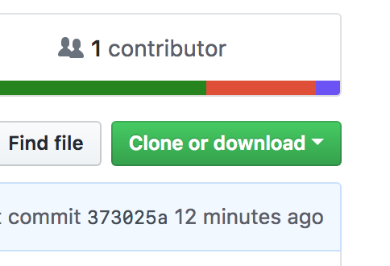
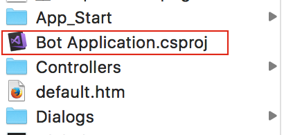
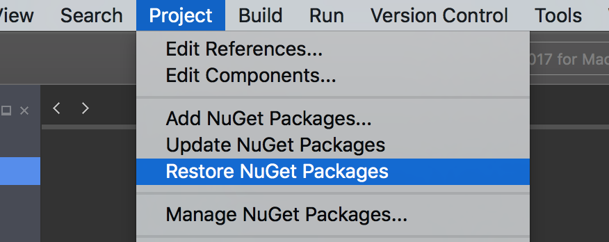
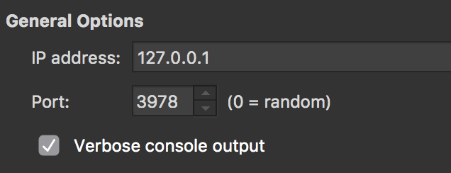
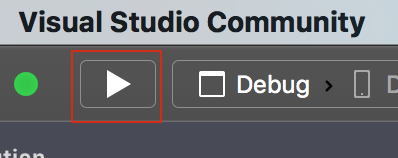
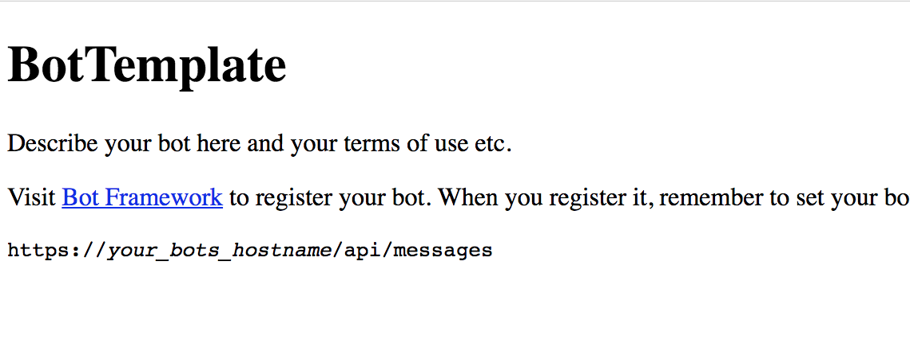
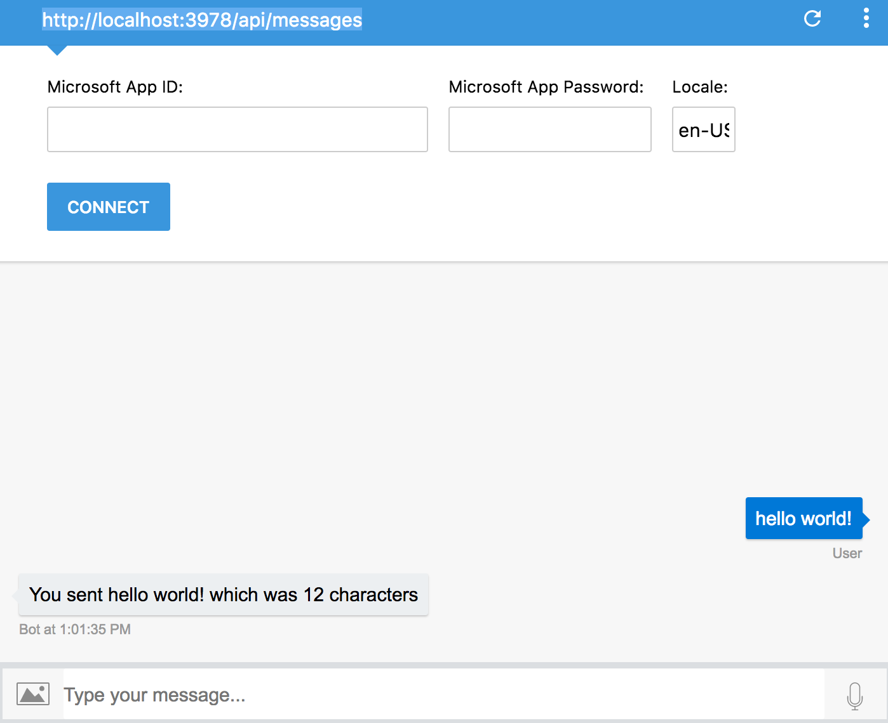

# botframework-template-vs-for-mac

Bot Framework template app you can build and run in VS for Mac

## Motivation

So you can create [C# Bots using Visual Studio for Windows](https://docs.microsoft.com/en-us/bot-framework/dotnet/bot-builder-dotnet-quickstart) and currently there are templates you can install in Visual Studio 2017 that allow you to create bots. The team states:


> The Bot Builder SDK for .NET currently supports C#. **Visual Studio for Mac is not supported.**

#### This repo enables you to build C# bots using [Visual Studio for Mac](https://www.visualstudio.com/vs/visual-studio-mac/)

## Prerequisites

* [Visual Studio for Mac](https://www.visualstudio.com/vs/visual-studio-mac/)


## Using

```
1. Clone or Download this repo
```



```
2. Open the .csproj
```



```
3. Restore NuGet packages 
```



```
4. Click on Project > Bot Application Options > Update 'Port:' to 3978
```



```
5. Run solution 
	- That will open up a webpage like the one 
```






```
6. Connect to Bot Framework Emulator
```



## Authors

* **Claudius Mbemba** - [user1m](https://github.com/user1m)

## License

This project is licensed under the MIT License 